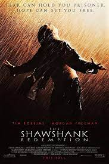
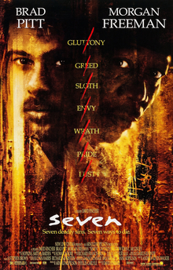
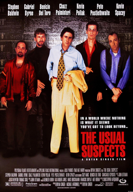

## Movie Database

<html>
<head>
    
  <link rel="stylesheet" type="text/css" href="styles.css">
  <title>Top 50 Movies</title>
</head>
<body>
  

    

    

      <ul class="blurred-list">
        <!-- Movie 1 -->
        <li>
            
            <h2>The Shawshank Redemption (1994)</h2>
            
Description: Two imprisoned men bond over a number of years, finding solace and eventual redemption through acts of common decency.

            
Genre: Drama

        </li>

        <!-- Movie 2 -->
        <li>
            
            <h2>The Godfather (1972)</h2>
            
Description: An organized crime dynasty's aging patriarch transfers control of his clandestine empire to his reluctant son.

            
Genre: Crime, Drama

        </li>

        <!-- Movie 3 -->
        <li>
            
            <h2>The Dark Knight (2008)</h2>
            
Description: When the menace known as The Joker emerges from his mysterious past, he wreaks havoc and chaos on the people of Gotham.

            
Genre: Action, Crime, Drama

        </li>

        <!-- Movie 4 -->
        <li>
            
            <h2>Schindler's List (1993)</h2>
            
Description: In German-occupied Poland during World War II, Oskar Schindler gradually becomes concerned for his Jewish workforce after witnessing their persecution by the Nazis.

            
Genre: Biography, Drama, History

        </li>

        <!-- Movie 5 -->
        <li>
            
            <h2>The Godfather Part II (1974)</h2>
            
Description: The early life and career of Vito Corleone in 1920s New York City is portrayed, while his son, Michael, expands and tightens his grip on the family crime syndicate.

            
Genre: Crime, Drama

        </li>

        <!-- Movie 6 -->
        <li>
            
            <h2>The Lord of the Rings: The Return of the King (2003)</h2>
            
Description: Gandalf and Aragorn lead the World of Men against Sauron's army to draw his gaze from Frodo and Sam as they approach Mount Doom with the One Ring.

            
Genre: Adventure, Drama, Fantasy

        </li>

        <!-- Movie 7 -->
        <li>
            
            <h2>12 Angry Men (1957)</h2>
            
Description: A jury holdout attempts to prevent a miscarriage of justice by forcing his colleagues to reconsider the evidence.

            
Genre: Drama

        </li>

        <!-- Movie 8 -->
        <li>
            
            <h2>Pulp Fiction (1994)</h2>
            
Description: The lives of two mob hitmen, a boxer, a gangster and his wife, and a pair of diner bandits intertwine in four tales of violence and redemption.

            
Genre: Crime, Drama

        </li>

        <!-- Movie 9 -->
        <li>
            
            <h2>Inception (2010)</h2>
            
Description: A thief who steals corporate secrets through the use of dream-sharing technology is given the inverse task of planting an idea into the mind of a C.E.O.

            
Genre: Action, Adventure, Sci-Fi

        </li>

        <!-- Movie 10 -->
        <li>
            
            <h2>The Lord of the Rings: The Fellowship of the Ring (2001)</h2>
            
Description: A meek Hobbit from the Shire and eight companions set out on a journey to destroy the powerful One Ring and save Middle-earth from the Dark Lord Sauron.

            
Genre: Adventure, Drama, Fantasy

        </li>

        <!-- Movie 11 -->
        <li>
            
            <h2>Fight Club (1999)</h2>
            
Description: An insomniac office worker and a devil-may-care soapmaker form an underground fight club that evolves into something much, much more.

            
Genre: Drama

        </li>

        <!-- Movie 12 -->
        <li>
            
            <h2>Forrest Gump (1994)</h2>
            
Description: The presidencies of Kennedy and Johnson, the Vietnam War, the Watergate scandal, and other historical events unfold from the perspective of an Alabama man with an IQ of 75.

            
Genre: Drama, Romance

        </li>

        <!-- Movie 13 -->
        <li>
            
            <h2>The Good, the Bad and the Ugly (1966)</h2>
            
Description: A bounty hunting scam joins two men in an uneasy alliance against a third in a race to find a fortune in gold buried in a remote cemetery.

            
Genre: Western

        </li>

        <!-- Movie 14 -->
        <li>
            
            <h2>The Lord of the Rings: The Two Towers (2002)</h2>
            
Description: While Frodo and Sam edge closer to Mordor with the help of the shifty Gollum, the divided fellowship makes a stand against Sauron's new ally, Saruman, and his hordes of Isengard.

            
Genre: Adventure, Drama, Fantasy

        </li>

        <!-- Movie 15 -->
        <li>
            
            <h2>Spider-Man: Across the Spider-Verse (2023)</h2>
            
Description: Plot details are kept under wraps.

            
Genre: Animation, Action, Adventure

        </li>

        <!-- Movie 16 -->
        <li>
            
            <h2>Interstellar (2014)</h2>
            
Description: A team of explorers travel through a wormhole in space in an attempt to ensure humanity's survival.

            
Genre: Adventure, Drama, Sci-Fi

        </li>

        <!-- Movie 17 -->
        <li>
            
            <h2>Goodfellas (1990)</h2>
            
Description: The story of Henry Hill and his life in the mob, covering his relationship with his wife Karen Hill and his mob partners Jimmy Conway and Tommy DeVito in the Italian-American crime syndicate.

            
Genre: Biography, Crime, Drama

        </li>

        <!-- Movie 18 -->
        <li>
            
            <h2>The Matrix (1999)</h2>
            
Description: A computer programmer discovers that reality as he knows it is a simulation created by machines to subjugate humanity.

            
Genre: Action, Sci-Fi

        </li>

        <!-- Movie 19 -->
        <li>
            
            <h2>One Flew Over the Cuckoo's Nest (1975)</h2>
            
Description: A criminal pleads insanity and is admitted to a mental institution, where he rebels against the oppressive nurse and rallies up the scared patients.

            
Genre: Drama

        </li>

        <!-- Movie 20 -->
        <li>
            
            <h2>Star Wars Episode V - The Empire Strikes Back (1980)</h2>
            
Description: After the Rebels are brutally overpowered by the Empire on the ice planet Hoth, Luke Skywalker begins Jedi training with Yoda, while his friends are pursued by Darth Vader.

            
Genre: Action, Adventure, Fantasy

        </li>

        <!-- Movie 21 -->
        <li>
            
            <h2>Oppenheimer (2023)</h2>
            
Description: The story of the development of the atomic bomb by the Manhattan Project during World War II.

            
Genre: Drama, History, War

        </li>

        <!-- Movie 22 -->
        <li>
            
            <h2>Se7en (1995)</h2>
            
Description: Two detectives, a rookie, and a veteran, hunt a serial killer who uses the seven deadly sins as his motives.

            
Genre: Crime, Drama, Mystery

        </li>

        <!-- Movie 23 -->
        <li>
            
            <h2>The Silence of the Lambs (1991)</h2>
            
Description: A young FBI cadet must receive the help of an incarcerated and manipulative cannibal killer to help catch another serial killer, a madman who skins his victims.

            
Genre: Crime, Drama, Thriller

        </li>

        <!-- Movie 24 -->
        <li>
            
            <h2>Saving Private Ryan (1998)</h2>
            
Description: Following the Normandy Landings, a group of U.S. soldiers go behind enemy lines to retrieve a paratrooper whose brothers have been killed in action.

            
Genre: Drama, War

        </li>

        <!-- Movie 25 -->
        <li>
            
            <h2>The Green Mile (1999)</h2>
            
Description: The lives of guards on Death Row are affected by one of their charges: a black man accused of child murder and rape, yet who has a mysterious gift.

            
Genre: Crime, Drama, Fantasy

        </li>

        <!-- Movie 26 -->
        <li>
            
            <h2>Star Wars Episode IV - A New Hope (1977)</h2>
            
Description: Luke Skywalker joins forces with a Jedi Knight, a cocky pilot, a Wookiee, and two droids to save the galaxy from the Empire's world-destroying battle station, while also attempting to rescue Princess Leia from the mysterious Darth Vader.

            
Genre: Action, Adventure, Fantasy

        </li>

        <!-- Movie 27 -->
        <li>
            
            <h2>Spirited Away (2001)</h2>
            
Description: During her family's move to the suburbs, a sullen 10-year-old girl wanders into a world ruled by gods, witches, and spirits, and where humans are changed into beasts.

            
Genre: Animation, Adventure, Family

        </li>

        <!-- Movie 28 -->
        <li>
            
            <h2>Terminator 2: Judgment Day (1991)</h2>
            
Description: A cyborg, identical to the one who failed to kill Sarah Connor, must now protect her ten-year-old son, John Connor, from a more advanced and powerful cyborg.

            
Genre: Action, Sci-Fi

        </li>

        <!-- Movie 29 -->
        <li>
            
            <h2>City of God (2002)</h2>
            
Description: In the slums of Rio, two kids' paths diverge as one struggles to become a photographer and the other a kingpin.

            
Genre: Crime, Drama

        </li>

        <!-- Movie 30 -->
        <li>
            
            <h2>Life is Beautiful (1997)</h2>
            
Description: When an open-minded Jewish librarian and his son become victims of the Holocaust, he uses a perfect mixture of will, humor, and imagination to protect his son from the dangers around their camp.

            
Genre: Comedy, Drama, Romance

        </li>

        <!-- Movie 31 -->
        <li>
            
            <h2>Seven Samurai (1954)</h2>
            
Description: A poor village under attack by bandits recruits seven unemployed samurai to help them defend themselves.

            
Genre: Action, Adventure, Drama

        </li>

        <!-- Movie 32 -->
        <li>
            
            <h2>It's a Wonderful Life (1946)</h2>
            
Description: An angel is sent from Heaven to help a desperately frustrated businessman by showing him what life would have been like if he had never existed.

            
Genre: Drama, Family, Fantasy

        </li>

        <!-- Movie 33 -->
        <li>
            
            <h2>Harakiri (1962)</h2>
            
Description: When a ronin requesting seppuku at a feudal lord's palace is told of the brutal suicide of another ronin who previously visited, he reveals how their pasts are intertwined - and in doing so challenges the clan's integrity.

            
Genre: Action, Drama, History

        </li>

        <!-- Movie 34 -->
        <li>
            
            <h2>Alien (1979)</h2>
            
Description: After a space merchant vessel receives an unknown transmission as a distress call, one of the crew is attacked by a mysterious lifeform and they soon realize that its life cycle has merely begun.

            
Genre: Horror, Sci-Fi

        </li>

        <!-- Movie 35 -->
        <li>
            
            <h2>Gladiator (2000)</h2>
            
Description: A former Roman General sets out to exact vengeance against the corrupt emperor who murdered his family and sent him into slavery.

            
Genre: Action, Adventure, Drama

        </li>

        <!-- Movie 36 -->
        <li>
            
            <h2>Back to the Future (1985)</h2>
            
Description: Marty McFly, a teenager, is accidentally sent thirty years into the past in a time-traveling DeLorean invented by his close friend eccentric scientist Doc Brown.

            
Genre: Adventure, Comedy, Sci-Fi

        </li>

        <!-- Movie 37 -->
        <li>
            
            <h2>The Prestige (2006)</h2>
            
Description: After a tragic accident, two stage magicians engage in a battle to create the ultimate illusion while sacrificing everything they have to outwit each other.

            
Genre: Drama, Mystery, Sci-Fi

        </li>

        <!-- Movie 38 -->
        <li>
            
            <h2>Parasite (2019)</h2>
            
Description: Greed and class discrimination threaten the newly formed symbiotic relationship between the wealthy Park family and the destitute Kim clan.

            
Genre: Comedy, Drama, Thriller

        </li>

        <!-- Movie 39 -->
        <li>
            
            <h2>The Departed (2006)</h2>
            
Description: An undercover cop and a mole in the police attempt to identify each other while infiltrating an Irish gang in South Boston.

            
Genre: Crime, Drama, Thriller

        </li>

        <!-- Movie 40 -->
        <li>
            
            <h2>Django Unchained (2012)</h2>
            
Description: With the help of a German bounty hunter, a freed slave sets out to rescue his wife from a brutal Mississippi plantation owner.

            
Genre: Drama, Western

        </li>

        <!-- Movie 41 -->
        <li>
            
            <h2>Psycho (1960)</h2>
            
Description: A Phoenix secretary embezzles $40,000 from her employer's client, goes on the run, and checks into a remote motel run by a disturbed innkeeper.

            
Genre: Horror, Mystery, Thriller

        </li>

        <!-- Movie 42 -->
        <li>
            
            <h2>American History X (1998)</h2>
            
Description: A former neo-nazi skinhead tries to prevent his younger brother from going down the same wrong path that he did.

            
Genre: Drama

        </li>

        <!-- Movie 43 -->
        <li>
            
            <h2>Whiplash (2014)</h2>
            
Description: A promising young drummer enrolls at a cut-throat music conservatory where his dreams of greatness are mentored by an instructor who will stop at nothing to realize a student's potential.

            
Genre: Drama, Music

        </li>

        <!-- Movie 55 -->
        <li>
            
            <h2>Léon: The Professional</h2>
            
Genre: Action, Crime, Drama

            
Description: Mathilda, a 12-year

        </li>

        <li>
            
            <h2>Rear Window (1954)</h2>
            
Description: A wheelchair-bound photographer spies on his neighbors from his apartment window and becomes convinced one of them has committed murder.

            
Genre: Mystery, Thriller

        </li>

        <!-- Movie 46 -->
        <li>
            
            <h2>The Lion King (1994)</h2>
            
Description: Lion prince Simba and his father are targeted by his bitter uncle, who wants to ascend the throne himself.

            
Genre: Animation, Adventure, Drama

        </li>

        <!-- Movie 47 -->
        <li>
            
            <h2>The Usual Suspects (1995)</h2>
            
Description: A sole survivor tells of the twisty events leading up to a horrific gun battle on a boat, which began when five criminals met at a seemingly random police lineup.

            
Genre: Crime, Mystery, Thriller

        </li>

        <!-- Movie 48 -->
        <li>
            
            <h2>The Pianist (2002)</h2>
            
Description: A Polish Jewish musician struggles to survive the destruction of the Warsaw ghetto of World War II.

            
Genre: Biography, Drama, Music

        </li>

        <!-- Movie 49 -->
        <li>
            
            <h2>Casablanca (1942)</h2>
            
Description: A cynical expatriate American cafe owner struggles to decide whether or not to help his former lover and her fugitive husband escape the Nazis in French Morocco.

            
Genre: Drama, Romance, War

        </li>

        <!-- Movie 50 -->
        <li>
            
            <h2>The Intouchables (2011)</h2>
            
Description: After he becomes a quadriplegic from a paragliding accident, an aristocrat hires a young man from the projects to be his caregiver.

            
Genre: Biography, Comedy, Drama

        </li>
      </ul>
    

  

</body>
</html>